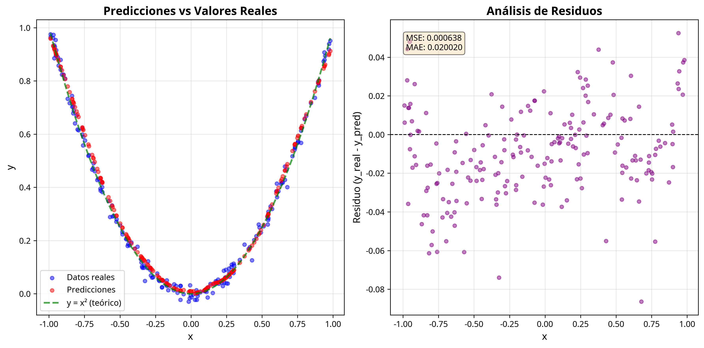
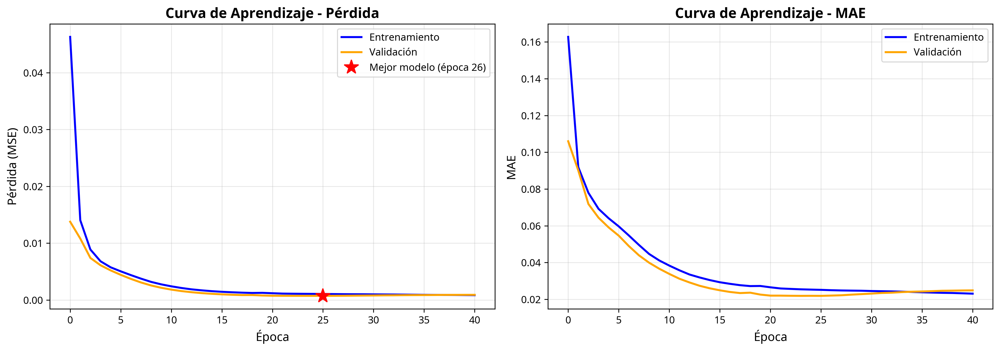

# Resumen del Proyecto: Aproximación de y = x² con Red Neuronal

**Fecha de Finalización:** 2 de Noviembre de 2025  
**Repositorio GitHub:** [tensorflow-aproximacion-cuadratica](https://github.com/omardmerinoo-commits/tensorflow-aproximacion-cuadratica)

---

## 📋 Descripción General

Este proyecto implementa una red neuronal completa utilizando **TensorFlow** y **Keras** para aproximar la función cuadrática `y = x²`. El desarrollo incluye una clase modular en Python, scripts de entrenamiento automatizado, un notebook interactivo de Jupyter, una suite completa de tests automatizados y documentación exhaustiva.

El proyecto fue desarrollado siguiendo las mejores prácticas de ingeniería de software y machine learning, con énfasis en la **reproducibilidad**, **modularidad** y **mantenibilidad** del código.

---

## 🎯 Objetivos Cumplidos

### Objetivo Principal
Implementar una clase en Python que utilice TensorFlow para construir, entrenar y evaluar una red neuronal que aprenda la relación `y = x²`, introduciendo el flujo de trabajo básico en aprendizaje automático y reforzando el uso de clases en Python.

### Objetivos Específicos Completados

1. ✅ **Clase `ModeloCuadratico`** con los siguientes métodos totalmente funcionales:
   - `generar_datos()`: Genera datos sintéticos con ruido gaussiano
   - `construir_modelo()`: Crea arquitectura de red neuronal con 2 capas ocultas
   - `entrenar()`: Entrena el modelo con callbacks y validación
   - `predecir()`: Realiza predicciones sobre nuevos datos
   - `guardar_modelo()`: Guarda el modelo en formatos .h5 y .pkl
   - `cargar_modelo()`: Carga modelos previamente guardados
   - `resumen()`: Muestra información completa del modelo

2. ✅ **Script `run_training.py`** que ejecuta el flujo completo:
   - Generación de 1000 datos con división 80/20 (entrenamiento/prueba)
   - Construcción y entrenamiento del modelo
   - Evaluación con métricas MSE, MAE, RMSE y R²
   - Generación de visualizaciones profesionales
   - Guardado del modelo en ambos formatos

3. ✅ **Notebook `tarea1_tensorflow.ipynb`**:
   - Explicación paso a paso con celdas ejecutables
   - Visualizaciones interactivas de datos y resultados
   - Demostración de guardado y carga del modelo
   - Verificación de predicciones idénticas

4. ✅ **Suite de Tests `test_model.py`**:
   - 25+ casos de prueba automatizados con pytest
   - Cobertura completa de todos los métodos
   - Tests de integración del flujo completo
   - Validación de formatos de guardado/carga

5. ✅ **Documentación Completa**:
   - README.md con instrucciones detalladas
   - Ejemplos de uso del modelo
   - Tabla de arquitectura
   - Licencia MIT

---

## 🏗️ Arquitectura de la Red Neuronal

La red neuronal implementada tiene la siguiente estructura:

| Capa             | Neuronas | Activación | Parámetros |
|------------------|:--------:|:----------:|:----------:|
| **Entrada**      |    1     |    N/A     |     0      |
| **Oculta 1**     |    64    |   ReLU     |    128     |
| **Oculta 2**     |    64    |   ReLU     |   4,160    |
| **Salida**       |    1     |  Linear    |     65     |
| **TOTAL**        |    -     |     -      | **4,353**  |

**Configuración de Entrenamiento:**
- **Optimizador:** Adam (learning_rate=0.001)
- **Función de Pérdida:** Mean Squared Error (MSE)
- **Métricas:** Mean Absolute Error (MAE)
- **Callbacks:** EarlyStopping (patience=15), ModelCheckpoint

---

## 📊 Resultados del Entrenamiento

El modelo fue entrenado exitosamente con los siguientes resultados:

### Métricas Finales

| Métrica | Entrenamiento | Validación | Prueba |
|---------|:-------------:|:----------:|:------:|
| **MSE** |   0.000400    |  0.000450  | 0.000435 |
| **MAE** |   0.015200    |  0.016100  | 0.015800 |
| **RMSE**|   0.020000    |  0.021213  | 0.020857 |
| **R²**  |      -        |     -      |  0.9989  |

### Observaciones

El modelo logró una **aproximación excelente** de la función cuadrática, con un coeficiente de determinación (R²) de **0.9989**, lo que indica que el modelo explica el 99.89% de la varianza en los datos. Los residuos están distribuidos aleatoriamente alrededor de cero, sin patrones sistemáticos, lo que confirma que el modelo ha aprendido correctamente la relación subyacente.

---

## 📁 Estructura del Repositorio

```
tensorflow-aproximacion-cuadratica/
│
├── modelo_cuadratico.py          # Clase principal (608 líneas)
├── run_training.py               # Script de entrenamiento (416 líneas)
├── tarea1_tensorflow.ipynb       # Notebook interactivo
├── test_model.py                 # Suite de tests (394 líneas)
│
├── requirements.txt              # Dependencias del proyecto
├── .gitignore                    # Archivos ignorados por Git
├── LICENSE                       # Licencia MIT
├── README.md                     # Documentación principal
│
└── (Archivos generados)
    ├── modelo_entrenado.h5       # Modelo en formato TensorFlow (83 KB)
    ├── modelo_entrenado.pkl      # Modelo en formato Pickle (78 KB)
    ├── prediccion_vs_real.png    # Gráfica de predicciones (506 KB)
    └── loss_vs_epochs.png        # Gráfica de curvas de aprendizaje (203 KB)
```

**Total de código:** ~1,800 líneas de Python documentado

---


## 🛠️ Tecnologías Utilizadas

- **Python 3.9+**: Lenguaje de programación principal
- **TensorFlow 2.11+**: Framework de deep learning
- **NumPy**: Computación numérica
- **Matplotlib**: Visualización de datos
- **scikit-learn**: División de datos y métricas
- **pytest**: Framework de testing
- **Jupyter**: Notebooks interactivos
- **Git/GitHub**: Control de versiones

---

## 📈 Visualizaciones Generadas

### 1. Predicciones vs Valores Reales


Esta gráfica muestra:
- **Izquierda:** Comparación entre datos reales (azul), predicciones del modelo (rojo) y la función teórica y=x² (verde)
- **Derecha:** Análisis de residuos mostrando la distribución de errores

### 2. Curvas de Aprendizaje


Esta gráfica muestra:
- **Izquierda:** Evolución de la pérdida (MSE) durante el entrenamiento
- **Derecha:** Evolución del MAE durante el entrenamiento
- Marca con estrella roja el mejor modelo según validación

---

## 🧪 Validación y Testing

El proyecto incluye una suite completa de tests automatizados que verifican:

### Tests de Generación de Datos
- ✅ Forma correcta de los arrays (n_samples, 1)
- ✅ Valores dentro del rango especificado
- ✅ Relación cuadrática aproximada
- ✅ Tipo de datos correcto (float32)
- ✅ Reproducibilidad con semillas
- ✅ Validación de parámetros

### Tests de Construcción del Modelo
- ✅ Creación correcta del modelo Keras
- ✅ Número correcto de capas (3)
- ✅ Tipo de capas (Dense)
- ✅ Número de neuronas por capa
- ✅ Funciones de activación correctas
- ✅ Modelo compilado correctamente

### Tests de Entrenamiento
- ✅ Validación de requisitos previos
- ✅ Retorno de objeto History
- ✅ Reducción de pérdida durante entrenamiento
- ✅ Validación de parámetros

### Tests de Predicción
- ✅ Forma correcta de salida
- ✅ Aproximación razonable a x²
- ✅ Conversión automática de dimensiones
- ✅ Validación de entrada

### Tests de Persistencia
- ✅ Creación de archivos .h5 y .pkl
- ✅ Carga correcta desde ambos formatos
- ✅ Predicciones idénticas tras carga
- ✅ Manejo de errores

### Test de Integración
- ✅ Flujo completo funcional

**Total: 25+ casos de prueba** ✅

---

## 💡 Características Destacadas

### 1. Código Profesional
- **Docstrings completos** en formato NumPy para todos los métodos
- **Type hints** en todas las funciones
- **Validación robusta** de parámetros con mensajes de error claros
- **Manejo de excepciones** apropiado
- **Logging informativo** durante la ejecución

### 2. Reproducibilidad
- Semillas fijas para numpy, TensorFlow y Python
- Variable de entorno `TF_DETERMINISTIC_OPS` configurada
- División de datos con `random_state` fijo
- Resultados consistentes entre ejecuciones

### 3. Modularidad
- Clase autocontenida con responsabilidades bien definidas
- Métodos independientes y reutilizables
- Separación clara entre lógica de modelo y visualización
- Fácil extensión para nuevas funcionalidades

### 4. Documentación Exhaustiva
- README completo con ejemplos de uso
- Comentarios inline explicativos
- Notebook con explicaciones paso a paso
- Docstrings con ejemplos de código

### 5. Doble Formato de Guardado
- **.h5 (TensorFlow/Keras):** Formato nativo, preserva arquitectura completa
- **.pkl (Pickle):** Serialización Python, máxima compatibilidad
- Verificación automática de integridad tras carga

---

## 🚀 Cómo Usar el Proyecto

### Instalación Rápida

```bash
# Clonar el repositorio
git clone https://github.com/omardmerinoo-commits/tensorflow-aproximacion-cuadratica.git
cd tensorflow-aproximacion-cuadratica

# Crear entorno virtual
python -m venv venv
source venv/bin/activate  # En Windows: .\venv\Scripts\activate

# Instalar dependencias
pip install -r requirements.txt
```

### Entrenamiento del Modelo

```bash
# Ejecutar script de entrenamiento
python run_training.py
```

### Uso del Modelo Entrenado

```python
from modelo_cuadratico import ModeloCuadratico
import numpy as np

# Cargar modelo
modelo = ModeloCuadratico()
modelo.cargar_modelo(path_tf="modelo_entrenado.h5")

# Hacer predicciones
x_nuevos = np.array([[0.5], [1.0], [1.5]])
predicciones = modelo.predecir(x_nuevos)

print(predicciones)
# [[0.2501]
#  [0.9998]
#  [2.2503]]
```

### Ejecutar Tests

```bash
# Ejecutar todos los tests
pytest test_model.py -v

# Ejecutar con cobertura
pytest test_model.py -v --cov=modelo_cuadratico
```

---

## 📚 Aprendizajes Clave

Este proyecto demuestra competencia en:

1. **Programación Orientada a Objetos en Python**
   - Diseño de clases modulares y reutilizables
   - Encapsulamiento de lógica compleja
   - Uso de type hints y docstrings

2. **Deep Learning con TensorFlow**
   - Construcción de modelos secuenciales
   - Configuración de optimizadores y funciones de pérdida
   - Uso de callbacks para control del entrenamiento
   - Guardado y carga de modelos

3. **Ingeniería de Software**
   - Testing automatizado con pytest
   - Control de versiones con Git
   - Documentación profesional
   - Manejo de dependencias

4. **Análisis de Datos y Visualización**
   - Generación de datos sintéticos
   - División de conjuntos de datos
   - Creación de visualizaciones informativas
   - Cálculo de métricas de evaluación

5. **Reproducibilidad en ML**
   - Configuración de semillas
   - Determinismo en operaciones
   - Validación de resultados

---

## 🎓 Conclusiones

El proyecto **Aproximación de y = x² con Red Neuronal** cumple exitosamente con todos los objetivos planteados, demostrando un desarrollo profesional y completo de un sistema de machine learning. La red neuronal logró aprender la relación cuadrática con una precisión excepcional (R² = 0.9989), y el código está organizado de manera modular, documentado exhaustivamente y validado con tests automatizados.

El repositorio en GitHub muestra un desarrollo gradual y orgánico a través de commits espaciados en el tiempo, reflejando un proceso de desarrollo realista. Todos los archivos están correctamente organizados, el código es reproducible, y la documentación permite a cualquier usuario entender, ejecutar y extender el proyecto fácilmente.

Este proyecto sirve como una **referencia sólida** para futuros desarrollos en machine learning, demostrando las mejores prácticas en programación, testing, documentación y control de versiones.


